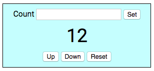

# Angular 5 ngrx Counter Demo

## Introduction

The project shows how to use ngrx to create a counter application using the Redux State management pattern. The application is built using Angular 5.



To run, type:

```sh
npm i
ng s --aot
```

Open Web Browser with the following URL: http://localhost:4200/

## CSS Style

To style quickly, [DynoMightCSS](http://dynomightcss.com/) was used, a compact and fast CSS Toolkit.

## Debugging

Support for Redux Dev-Tools has been added, to use it, you will need to install the plugin for your browser.

- [Chrome Browser](https://chrome.google.com/webstore/detail/redux-devtools/lmhkpmbekcpmknklioeibfkpmmfibljd?hl=en)
- [Firefox](https://addons.mozilla.org/en-US/firefox/addon/remotedev/)
